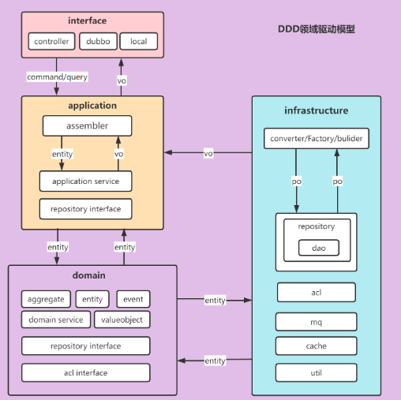
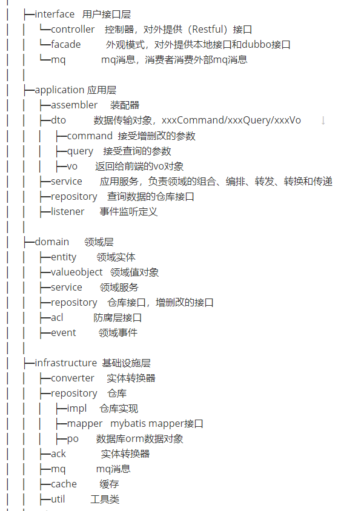

#  这个项目是干什么的
- 提供单体spring-boot基础框架，让你进行快速开发。对于每次新建项目时，建包、日志、日志格式文件、数据库配置等等...通用功能的搭建太耽误我们的时间。于是就写了这个仓库，为什么不是说写了框架因为我并没有创造什么！使用的时候将他拉取下来修改文件夹名字，就搭建好了基础框架。
- 其实这个仓库更像是一个web项目，但是没有业务在其中。拉取本项目到本地打开其中有样例说明
- 记得我学习spring-boot的时候，有一句话到现在仍记得`约定大于配置`,所以我希望使用本项目的遵从我的约定，当然你也可以进行改动
## 目前已搭建好

1. API请求监控
2. 全局异常日志监控
3. 提供日志文件格式
4. 全局响应类
5. Redis序列化
6. swagger通用配置
7. knife4j框架集成
8. 跨域配置
9. 通用的yml配置

## 目前已集成的依赖

### spring-boot帮我们做版本依赖

1. `spring-boot-starter-web`:servlet 
2. `spring-boot-starter-aop`:aop编程
3. `spring-boot-starter-test`:模块测试
4. `spring-boot-starter-validation`:参数校验
5. `spring-boot-starter-data-redis`:redis集成
6. `mysql-connector-j`:MySQL驱动
7. `spring-boot-starter-jdbc`:基于MySQL驱动提供jdbc简单编程
8. `lombok`:get/set方法

### 需要去官网/仓库去看版本信息

1. `hutool-all`:java语法糖
2. `knife4j-openapi3-jakarta-spring-boot-starter`:基于swagger的接口测试框架
3. `mybatis-plus-boot-starter`:用代码写SQL
4. `pagehelper-spring-boot-starter`:分页工具
5. `fastjson2`:序列化工具

## 测试说明

1. 在`com.template.controller`包下有三个测试文件测试项目集成的依赖、功能能否使用。当然这样存放文件是不标准，测试结束没问题可以删除，注意exception包的文件不可以删除可以修改
   - Redis集成测试
   - MySQL集成测试
   - 日志监控测试
2. 测试接口框架：查看`localhost:8080/doc.html`
3. 在`application-dev.yml`文件中
   - redis：需要连接自己的
   - mysql：需要来连接自己数据库，**script/init.sql**提供了sql脚本请务必使用，否则关于MySQL的测试可能失败

## 启动类说明

1. 项目中能使用并带有`Enable`的注解都已经加上

## 包介绍
- **文件存放请按图说明来**

- **传统的MVC开发到后面会发现，项目越来越臃肿，所以包结构采用DDD开发模式。详细内容见下图**

- ##### 实际DDD是一种思想`就是软件的领域开发，一个“原子”领域就是一种不开拆分业务的昵称,可以称之为业务开发`，传统的MVC以数据为基础。所以采用DDD开发模式，包结构需要有所变化，但是没有标准的命名，下面是简化版
- ##### 开发流程：如果根据DDD思想详细流程见下图，传统的`controller <-- service <-- dao`,service层太广泛所以采用domain的领域思想，更具业务创建service

```text
main/
├── java
│   └── com
│       └── template
│           ├── Application.java 启动类
│           ├── config     配置包
│           ├── controller  接口层
│           │   ├── exception   接口统一处理异常类
│           │   │   └── ExceptionController.java
│           │   ├── TestController.java  测试类
│           │   ├── TestUseEntity.java 测试类
│           │   └── TestUserMapper.java 测试类
│           ├── core   核心包
│           │   ├── log
│           │   │   ├── BaseLog.java    controller日志监控，异常统一监控
│           │   │   └── MonitorAPI.java  扩展接口
│           │   ├── redis
│           │   │   └── config  
│           │   │       └── RedisConfig.java   redis序列化类
│           │   ├── resp
│           │   │   ├── Resp.java  全局响应类
│           │   │   └── R.java    扩展
│           │   ├── swagger
│           │   │   └── SwaggerConfig.java  swagger配置类
│           │   └── web
│           │       └── SpringMvcWebConfig.java   mvc配置类
│           ├── domain   领域层
│           │   └── users   用于业务相关的操作都在这里
│           │       ├── services    跟MVC的service一样的作用
│           │       └── types   领域相关字典
│           │       └── model   传统的MVC什么VO、DTO都在一个包现在放在这个model包下
│           ├── infrastructure   基础设施层
│           │   ├── exception  全局自定义异常包，领域相关异常在domain层
│           │   ├── filter   过滤器
│           │   ├── interceptor  拦截器
│           │   └── repository   跟MVC的dao层一样的作用
│           │       ├── entities  实体包
│           │       └── mapper 映射操作接口包
│           └── utils
└── resources
    ├── application-dev.yml   开发环境配置
    ├── application-swagger.yml   swagger配置
    ├── application.yml 通用配置
    ├── logback.xml   log格式文件
    └── img  存放img图片
    └── script
        └── init.sql
```

## DDD开发模式

- 具体内容可以见[DDD领域驱动设计](https://blog.csdn.net/qq_41889508/article/details/124907312)
  1. **MVC的开发模式**：是数据驱动，自低向上的思想，关注数据。
  2. **DDD的开发模式**：是领域驱动，自顶向下，关注业务活动。

**MVC VS DDD**


## CQRS实战

- CQRS(Command Query Responsibility Segregation)是将Command(命令)与Query(查询)分离的一种模式。其基本思想在于：任何一个方法都可以拆分为命令和查询两部分：
- Command：不返回任何结果(void)，但会改变对象的状态。Command是引起数据变化操作的总称，一般会执行某个动作，如：新增，更新，删除等操作。操作都封装在Command中，用户提交Commond到CommandBus，然后分发到对应的CommandHandler中执行。Command执行后通过Repository将数据持久化。事件源(Event source)CQRS，Command将特定的Event发送到EventBus，然后由特定的EventHandler处理。
- Query：返回查询结果，不会对数据产生变化的操作，只是按照某些条件查找数据。基于Query条件，返回查询结果；为不同的场景定制不同的Facade。

**DDD开发流程**



**标准包结构：借鉴。**


